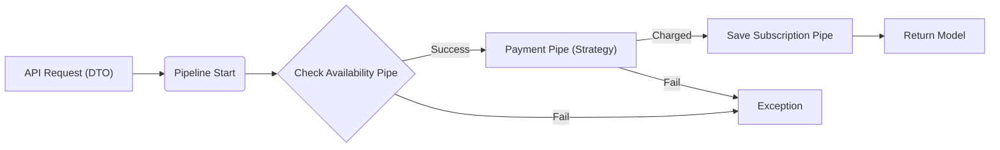

# Subify


### Modular SaaS Subscription & Billing API

[](https://github.com/web-inwall/subify/actions)
[](https://php.net)
[](https://laravel.com)
[](https://www.postgresql.org/)
[](https://redis.io/)
[](https://www.php-fig.org/psr/psr-12/)
[](https://github.com/larastan/larastan)

**Subify** is an enterprise-grade subscription management engine designed for high-scale SaaS applications. Built on a modular monolith architecture, it leverages advanced design patterns to decouple billing logic, making it easy to swap payment providers, define complex billing cycles, and maintain strict data integrity.

---

## 🛠 Tech Stack

| Component | Technology | Description |
| :--- | :--- | :--- |
| **Framework** | Laravel 12 | The latest bleeding-edge framework version. |
| **Language** | PHP 8.4 | Strong typing and performance features. |
| **Database** | PostgreSQL | Utilizing JSONB for flexible plan feature storage. |
| **Cache** | Redis | High-speed caching and queue management. |
| **Architecture** | Domain-Driven Design | Modular structure located in `app/Domains`. |

---

## ✨ Key Features

Subify is engineered for maintainability and scalability.

*   🚀 **Pipeline Pattern**
    Complex subscription flow logic is decoupled into reusable pipes (`Validate` -> `Charge` -> `Activate`). This allows you to inject or remove steps (like fraud checks or provisioning) without touching the core controller.

*   💳 **Strategy Pattern**
    Payment Gateway abstraction allowing hot-swap between Stripe, PayPal, or custom providers. The system depends on the interface, not the implementation.

*   🛡️ **Strict DTOs**
    I avoid "array hell" by using `spatie/laravel-data`. Every input is validated and cast to a strict Data Transfer Object before it reaches domain logic.

*   💾 **JSONB Snapshots**
    Plans change, but historical subscriptions shouldn't. I store an immutable snapshot of plan features at the time of subscription using PostgreSQL JSONB, ensuring grandfathered pricing works out of the box.

*   🏗️ **Modular Monolith**
    The codebase follows strict Domain-Driven Design (DDD) principles. All subscription logic lives in `app/Domains/Subscription`, isolating it from the rest of the application.

---

## 📖 Architecture

The subscription creation process follows a strict linear pipeline, ensuring that a user is only subscribed if all previous steps (validation, payment) succeed.


---

## 🔌 API Reference

### Create a Subscription

Initiate a new subscription for a user.

**Endpoint:** `POST /api/subscriptions`

#### Request Body

```json
{
  "user_id": 105,
  "plan": "premium_yearly",
  "payment_method_id": "pm_card_visa",
  "options": {
    "coupon": "SUMMER_SALE_2026",
    "metadata": {
      "source": "landing_page_v2"
    }
  }
}
```

#### Response (201 Created)

```json
{
  "data": {
    "id": "sub_1Qj2M5L...",
    "status": "active",
    "plan_snapshot": {
        "name": "Premium Yearly",
        "price": 9900,
        "currency": "USD"
    },
    "current_period_start": "2026-01-27T14:30:00Z",
    "current_period_end": "2027-01-27T14:30:00Z"
  }
}
```

---

## ⚙️ Configuration

Copy the example environment file and configure your keys.

| Variable | Description | Default |
| :--- | :--- | :--- |
| `PAYMENT_GATEWAY` | Default payment driver (`stripe`, `fake`). | `stripe` |
| `STRIPE_KEY` | Your Stripe Secret Key. | - |
| `STRIPE_WEBHOOK_SECRET` | Secret for verifying webhook signatures. | - |
| `DB_CONNECTION` | Database connection. | `pgsql` |

---

## 🚀 Installation & Testing

### Quick Start

Get up and running with Docker and Laravel Sail.

```bash
# 1. Clone the repository
git clone https://github.com/web-inwall/subify.git
cd subify

# 2. Install Dependencies
composer install

# 3. Setup Environment
cp .env.example .env

# 4. Start Containers
./vendor/bin/sail up -d

# 5. Run Migrations
./vendor/bin/sail artisan migrate
```

### Testing Pipelines

I take testing seriously. Run the test suite to see how I mock the Payment Strategy in unit and feature tests.

```bash
php artisan test
```

> **Note:** The `FakePaymentAdapter` is used by default in the `testing` environment, so no actual API calls are made during CI/CD.
